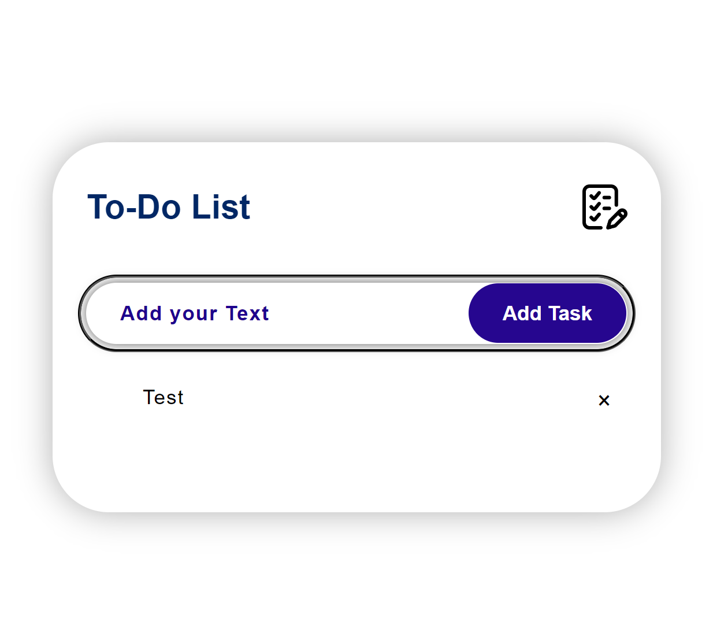

# To-Do List App

A minimalistic and interactive To-Do List app built with **HTML**, **CSS**, and **JavaScript**. This app allows users to add tasks, mark them as complete/incomplete, and delete tasks with ease.

## Features

- **Add Tasks**: Quickly add new tasks to your list.
- **Check/Uncheck Tasks**: Mark tasks as complete or incomplete by checking/unchecking them.
- **Delete Tasks**: Remove tasks individually when they are no longer needed.

## Demo

Check out the live demo of the project [here](https://sanskargupta0.github.io/To-Do-List/).



## Installation and Setup

1. Clone the repository or download the source code:
    ```bash
    git clone https://github.com/Sanskargupta0/To-Do-List.git
    ```

2. Navigate to the project folder:
    ```bash
    cd To-Do-List
    ```

3. Open `index.html` in your web browser:
    ```bash
    open index.html
    ```

## Usage

- **Add a Task**: Type your task in the input field and press the "Add" button.
- **Mark Task as Complete/Incomplete**: Click on the checkbox next to a task to mark it as complete or uncheck it to mark it as incomplete.
- **Delete a Task**: Click the "Delete" button next to the task to remove it from the list.

